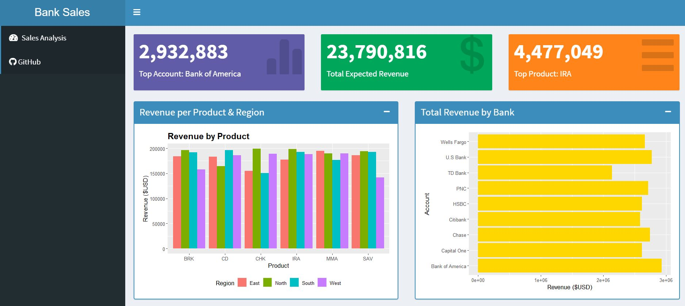

# Bank Revenue R Shiny Dashboard
A simple R Shiny web app displaying using the [shinydashboard](https://rstudio.github.io/shinydashboard/index.html) R library to display bank revenue data. Bank revenue data are ficticious and were generated using [Mockaroo](https://www.mockaroo.com/) for demo purposes.

App is deployed live [here - ShinyApps.io](https://bicaj.shinyapps.io/bank-revenue-dashboard/)

